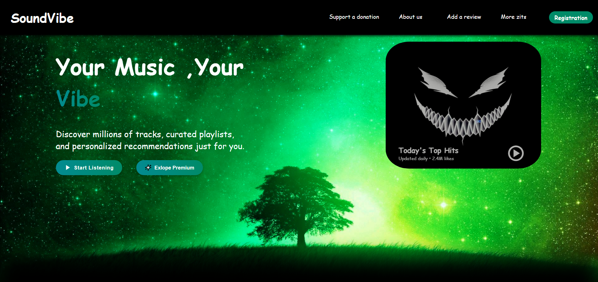

# 🎵 SoundVibe – Music Platform



## 📖 Опис
**SoundVibe** — це сучасна веб-платформа для прослуховування та відкриття нової музики. Створена з використанням **HTML та CSS**, вона має адаптивний дизайн, що забезпечує чудовий досвід на будь-якому пристрої.

### 🔥 Особливості
- 🎧 Каталог музичних треків з інформацією про виконавців  
- ❤️ Додавання улюблених треків до списку
- 📱 Адаптивний інтерфейс для смартфонів та планшетів
- 🌈 Мінімалістичний та привабливий дизайн

## 🚀 Як запустити?
1. Склонуйте репозиторій:
   ```bash
   git clone https://github.com/username/soundvibe.git
   ```
2. Відкрийте `index.html` у браузері

